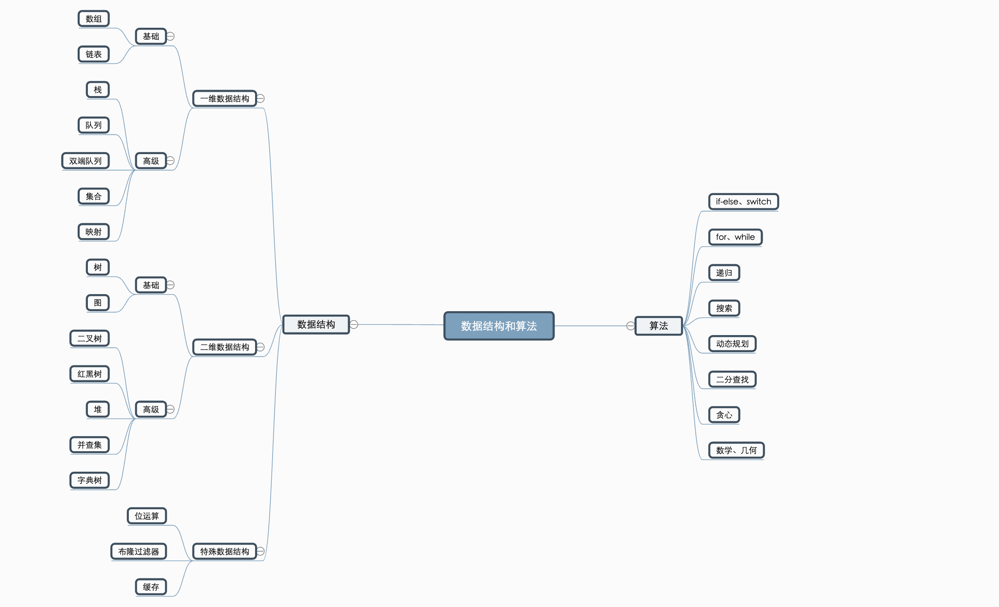

# 算法与数据结构总览

## 数据结构三大分类
- 一维数据结构
- 二维数据结构
- 特殊数据结构

**一维数据结构**

一维分为基础型和高级两大类：

- 基础：数组(array)、链表(linked list)
- 高级：栈(stack)、队列(queue)、双端队列(deque)、集合(set)、映射(map)

**二维数据结构**

二维的数据结构都是从一维泛化而来的，当一个一维度的链表它的分叉有两个的时候，它就变成了一个二维数据结构，相当于树。基础的就树和图，高级的是在树图的基础上加了很多判断和约定，比如说二叉搜索树。

基础：树(tree)、图(graph)

高级：二叉搜索树(binary search tree)、红黑树(red-black tree)、堆(heap)、并查集(disjoint set)、字典树(Trie)

**特殊数据结构**

用于工程中特定的情景，比如说位运算和基于位运算得出的布隆过滤器

特殊：位运算(Bitwise)、布隆过滤器(Bloom filter)、缓存(LRU Cache)

## 算法八大点

前三部分是所有算法和数据结构的基石，任何高级的算法数据结构到了最后都会转换成 if else 、for、递归 。

1. if-else、switch 逻辑的切换
2. for、while 循环
3. Recursion 递归
4. 搜索(Search)、深度优先搜索(Depth first search)、广度优先搜索(Breadth first search)
5. 动态规划(Dynamic Proramming)
5. 二分查找(Binary Search)
6. 贪心(Greedy)
7. 数学(Math)、几何(Geometry)

## 课后作业
绘制自己的数据结构和算法脑图
用脑图的方式把知识的脉络串联起来，不管对于学习新知识还是巩固已有知识，都是一种很好的学习方式。同学们可以将目前自己所掌握的数据结构和算法知识绘制成脑图，在绘制过程中可以查阅资料，补充目前掌握欠缺的部分，找到自己薄弱的地方。后面再通过课程的学习和刻意练习，动态地将自己绘制的脑图逐步补充、完善，从而达到真正的融会贯通。

脑图绘制工具不限，同学们需要按时将作业提交到班级 GitHub 中。